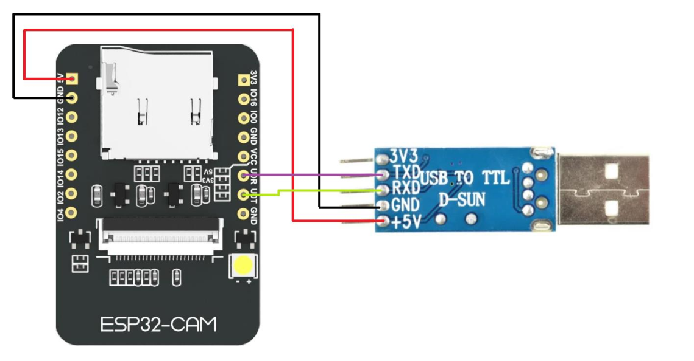
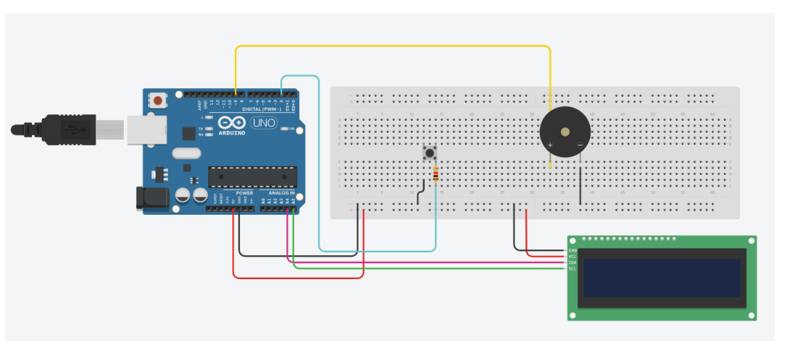

# Smart Doorbell Project Documentation

Intelligent door bell. After ringing, it recognizes if the person that is at the door is someone known from the owner or not. It is also possible to send an audio to the house owner, that will then receive it by email. Basic concept that can be further explored.

## Camera Setup

To capture images with the camera, follow these steps:

1. In Arduino IDE:
   - Go to Preferences > Additional boards manager URLs and add:
     ```
     https://raw.githubusercontent.com/espressif/arduino-esp32/gh-pages/package_esp32_index.json
     ```
   - Install the ESP32 board (by Espressif Systems) via Tools > Board > Boards Manager
   - Select the AI Thinker ESP32-CAM board and the connected port

2. Download the esp32cam.h library from: https://github.com/yoursunny/esp32cam.git
Then in Arduino IDE: Sketch > Include Library > Add .ZIP library

3. In the Camera.ino sketch, update WiFi credentials (network name and password) and upload the sketch.

### Important Notes:
- **Uploading**: Pin IO0 must be connected to GND during upload. After completion:
1. Remove this connection
2. Press the Reset button on the module
3. Open Serial Monitor to see connection status and HTTP link for accessing photos

- **Viewing Images**: Your device must be on the same WiFi network as the camera

- **USB-Serial Converter**: May require driver installation for your specific converter model

- **Hardware Connections**: 
 


---

## Arduino Setup

The Arduino code is located in the `Campainhainteligente` folder (`Campainhainteligente.ino` and `pitches.h` files). 

Required library:
- Grove – LCD RGB Backlight by Seeed Studio

### Components:
- Arduino UNO
- Push button
- 1 kΩ resistor
- Buzzer
- 16×2 LCD (I2C)

### Assembly:
 


---

## Raspberry Pi Setup

To run the Python code on Raspberry Pi:

1. Required folder structure:

project_folder/
├── arduino.py
├── campainha_interface.py
├── Caras/ (faces directory)
└── NovasCaras/ (new faces directory)


# Python Requirements

## Core Dependencies

```python
# System
import os
import sys
import time
import re
import json
import threading
from datetime import datetime
